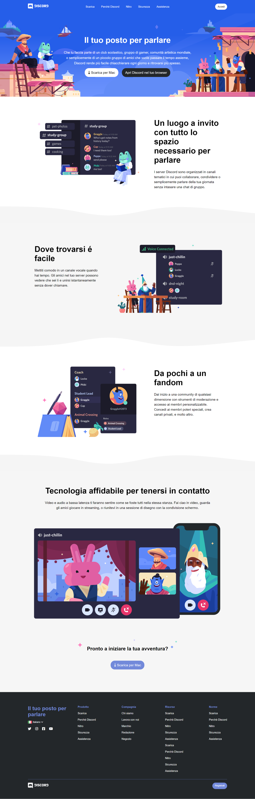

# Replica sito Discord

Questo repository è stato creato come parte di un esercizio di pratica per sviluppare le abilità di HTML e CSS. L'obiettivo principale di questo progetto è riprodurre un layout basato su uno screenshot fornito, cercando di essere il più fedeli possibile al design originale.

Ho iniziato con la riproduzione dei blocchi colorati del layout con un approccio step-by-step, lavorando su ciascuna sezione una alla volta. L'obiettivo era comprendere gli elementi ricorrenti nel layout e identificare quali parti potevano essere centralizzate attraverso l'uso di classi CSS riutilizzabili.

Ho utilizzato alcune risorse esterne per migliorare l'aspetto del layout:

- Ho incluso Font Awesome utilizzando il CDN per le icone all'interno del progetto.

- Per il font, è stato utilizzato Whitney, definendo una famiglia di caratteri che include 'Helvetica Neue', Helvetica, Arial, sans-serif.

È importante notare che non mi sono concentrato sulla resa responsive in questa fase del progetto. La pagina non è stata progettata per adattarsi a una varietà di viewport, ma ho comunque iniziato a lavorare con unità relative per eventuali future iterazioni.

## Layout di riferimento



## Struttura

```bash
.
├── index.html
│
├── css/
│   └── style.css
│
├── img/
│   ├── logo.svg
│   ├── item1.svg
│   ├── item2.svg
│   ├── item3.svg
│   ├── item4-big.svg
│   ├── wave.svg
│   ├── discord.png
│   └── ita.png
│
└── README.md
```
